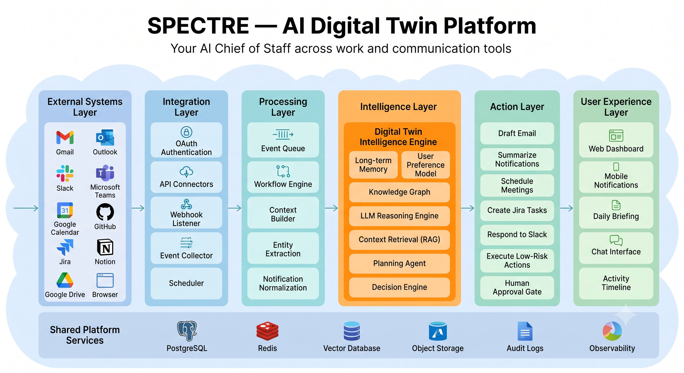

# SPECTRE

> **AI Digital Twin Platform** — Your AI Chief of Staff across work and communication tools.

## Overview

Spectre is an AI-powered Digital Twin designed to act as a personal Chief of Staff. It continuously understands user context across communication and productivity platforms, prioritizes work, automates low-risk tasks, and keeps the user informed through intelligent decision-making.

Rather than functioning as a single-purpose AI assistant, Spectre serves as an orchestration layer that connects multiple enterprise tools and executes context-aware workflows using LLM reasoning.

---

## Architecture

The platform follows a layered architecture:

- **External Systems Layer** – Integrates with productivity and collaboration platforms such as Gmail, Outlook, Slack, Teams, GitHub, Jira, Notion, Calendar, and Drive.
- **Integration Layer** – Handles OAuth authentication, API connectors, webhooks, scheduling, and event collection.
- **Processing Layer** – Normalizes incoming events, builds contextual information, and prepares data for reasoning.
- **Intelligence Layer** – The core Digital Twin engine responsible for long-term memory, knowledge retrieval, LLM reasoning, planning, and decision-making.
- **Action Layer** – Executes low-risk actions, drafts responses, schedules meetings, creates tasks, and routes sensitive operations through human approval.
- **User Experience Layer** – Delivers dashboards, notifications, daily briefings, chat interactions, and activity timelines.

---

## Core Capabilities

- Persistent Digital Twin with long-term memory
- Context-aware LLM reasoning
- Multi-platform workflow orchestration
- Retrieval-Augmented Generation (RAG)
- Human-in-the-loop approvals
- Intelligent task prioritization
- Autonomous execution of low-risk actions

---

## Technology Stack

- .NET 8
- OpenAI
- PostgreSQL
- Redis
- Vector Database
- Docker
- REST APIs
- OAuth 2.0

---

## Status

🚧 Architecture and system design completed.

Implementation is planned as a production-grade, scalable AI platform following this reference architecture.
